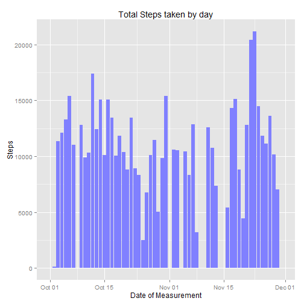
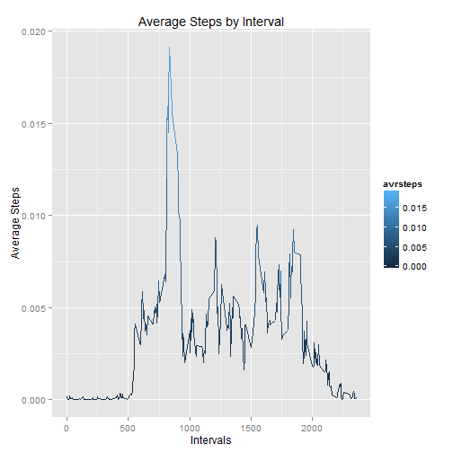
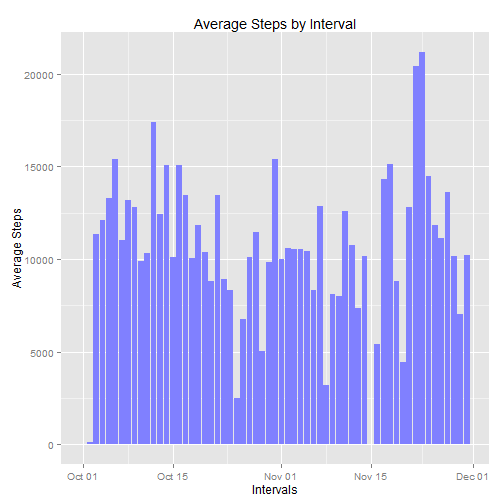
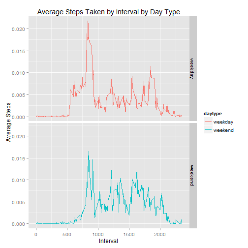

For this project I didn't want to use any other library to process the data but the base, as a challenge to myself and as a way to learn more deepply how R works, I know that it would have been easier with dplyr or reshape2, but it wouldn't have been as fun :D , the libraries loaded are used because the project demands it to, or because the base plots are plain ulgy.  

## Loading and preprocessing the data
First, load the libraries to use and set the Locale  

```r
library(ggplot2)
library(xtable)
Sys.setlocale("LC_TIME", "english")
```

```
## [1] "English_United States.1252"
```

Load the data.  


```r
datos <- read.csv("activity.csv")
```

Luckily, the data is already tidy.  


## What is mean total number of steps taken per day?

### Histogram of the total number of steps taken each day  
Make the vectors **x** and **y** and build our plot.  


```r
stepsbyday <- split(datos$steps,datos$date)
totalsteps <- sapply(stepsbyday, sum, na.rm = TRUE)
totaldays <- strptime(names(totalsteps),"%Y-%m-%d")
miplot <- ggplot()
mibar <- geom_bar(aes(totaldays,totalsteps),
                  stat = "identity", fill = rgb(0.5,0.5,1))
milabs <- labs(x = "Date of Measurement",
               y = "Steps",
               title = "Total Steps taken by day")

print(miplot+mibar+milabs)
```

 
  
### mean and median total number of steps taken per day  


```r
mean_day <- sapply(stepsbyday,mean, na.rm =TRUE)
median_day <- sapply(stepsbyday,median, na.rm =TRUE)
```

And see the result in a table: 

```r
mytable <- xtable(data.frame(totalsteps,mean_day,median_day),
                  align = "cccc" )
print(mytable, type = "html")
```

<!-- html table generated in R 3.1.3 by xtable 1.7-4 package -->
<!-- Thu Jun 11 10:25:36 2015 -->
<table border=1>
<tr> <th>  </th> <th> totalsteps </th> <th> mean_day </th> <th> median_day </th>  </tr>
  <tr> <td align="center"> 2012-10-01 </td> <td align="center">   0 </td> <td align="center">  </td> <td align="center">  </td> </tr>
  <tr> <td align="center"> 2012-10-02 </td> <td align="center"> 126 </td> <td align="center"> 0.44 </td> <td align="center"> 0.00 </td> </tr>
  <tr> <td align="center"> 2012-10-03 </td> <td align="center"> 11352 </td> <td align="center"> 39.42 </td> <td align="center"> 0.00 </td> </tr>
  <tr> <td align="center"> 2012-10-04 </td> <td align="center"> 12116 </td> <td align="center"> 42.07 </td> <td align="center"> 0.00 </td> </tr>
  <tr> <td align="center"> 2012-10-05 </td> <td align="center"> 13294 </td> <td align="center"> 46.16 </td> <td align="center"> 0.00 </td> </tr>
  <tr> <td align="center"> 2012-10-06 </td> <td align="center"> 15420 </td> <td align="center"> 53.54 </td> <td align="center"> 0.00 </td> </tr>
  <tr> <td align="center"> 2012-10-07 </td> <td align="center"> 11015 </td> <td align="center"> 38.25 </td> <td align="center"> 0.00 </td> </tr>
  <tr> <td align="center"> 2012-10-08 </td> <td align="center">   0 </td> <td align="center">  </td> <td align="center">  </td> </tr>
  <tr> <td align="center"> 2012-10-09 </td> <td align="center"> 12811 </td> <td align="center"> 44.48 </td> <td align="center"> 0.00 </td> </tr>
  <tr> <td align="center"> 2012-10-10 </td> <td align="center"> 9900 </td> <td align="center"> 34.38 </td> <td align="center"> 0.00 </td> </tr>
  <tr> <td align="center"> 2012-10-11 </td> <td align="center"> 10304 </td> <td align="center"> 35.78 </td> <td align="center"> 0.00 </td> </tr>
  <tr> <td align="center"> 2012-10-12 </td> <td align="center"> 17382 </td> <td align="center"> 60.35 </td> <td align="center"> 0.00 </td> </tr>
  <tr> <td align="center"> 2012-10-13 </td> <td align="center"> 12426 </td> <td align="center"> 43.15 </td> <td align="center"> 0.00 </td> </tr>
  <tr> <td align="center"> 2012-10-14 </td> <td align="center"> 15098 </td> <td align="center"> 52.42 </td> <td align="center"> 0.00 </td> </tr>
  <tr> <td align="center"> 2012-10-15 </td> <td align="center"> 10139 </td> <td align="center"> 35.20 </td> <td align="center"> 0.00 </td> </tr>
  <tr> <td align="center"> 2012-10-16 </td> <td align="center"> 15084 </td> <td align="center"> 52.38 </td> <td align="center"> 0.00 </td> </tr>
  <tr> <td align="center"> 2012-10-17 </td> <td align="center"> 13452 </td> <td align="center"> 46.71 </td> <td align="center"> 0.00 </td> </tr>
  <tr> <td align="center"> 2012-10-18 </td> <td align="center"> 10056 </td> <td align="center"> 34.92 </td> <td align="center"> 0.00 </td> </tr>
  <tr> <td align="center"> 2012-10-19 </td> <td align="center"> 11829 </td> <td align="center"> 41.07 </td> <td align="center"> 0.00 </td> </tr>
  <tr> <td align="center"> 2012-10-20 </td> <td align="center"> 10395 </td> <td align="center"> 36.09 </td> <td align="center"> 0.00 </td> </tr>
  <tr> <td align="center"> 2012-10-21 </td> <td align="center"> 8821 </td> <td align="center"> 30.63 </td> <td align="center"> 0.00 </td> </tr>
  <tr> <td align="center"> 2012-10-22 </td> <td align="center"> 13460 </td> <td align="center"> 46.74 </td> <td align="center"> 0.00 </td> </tr>
  <tr> <td align="center"> 2012-10-23 </td> <td align="center"> 8918 </td> <td align="center"> 30.97 </td> <td align="center"> 0.00 </td> </tr>
  <tr> <td align="center"> 2012-10-24 </td> <td align="center"> 8355 </td> <td align="center"> 29.01 </td> <td align="center"> 0.00 </td> </tr>
  <tr> <td align="center"> 2012-10-25 </td> <td align="center"> 2492 </td> <td align="center"> 8.65 </td> <td align="center"> 0.00 </td> </tr>
  <tr> <td align="center"> 2012-10-26 </td> <td align="center"> 6778 </td> <td align="center"> 23.53 </td> <td align="center"> 0.00 </td> </tr>
  <tr> <td align="center"> 2012-10-27 </td> <td align="center"> 10119 </td> <td align="center"> 35.14 </td> <td align="center"> 0.00 </td> </tr>
  <tr> <td align="center"> 2012-10-28 </td> <td align="center"> 11458 </td> <td align="center"> 39.78 </td> <td align="center"> 0.00 </td> </tr>
  <tr> <td align="center"> 2012-10-29 </td> <td align="center"> 5018 </td> <td align="center"> 17.42 </td> <td align="center"> 0.00 </td> </tr>
  <tr> <td align="center"> 2012-10-30 </td> <td align="center"> 9819 </td> <td align="center"> 34.09 </td> <td align="center"> 0.00 </td> </tr>
  <tr> <td align="center"> 2012-10-31 </td> <td align="center"> 15414 </td> <td align="center"> 53.52 </td> <td align="center"> 0.00 </td> </tr>
  <tr> <td align="center"> 2012-11-01 </td> <td align="center">   0 </td> <td align="center">  </td> <td align="center">  </td> </tr>
  <tr> <td align="center"> 2012-11-02 </td> <td align="center"> 10600 </td> <td align="center"> 36.81 </td> <td align="center"> 0.00 </td> </tr>
  <tr> <td align="center"> 2012-11-03 </td> <td align="center"> 10571 </td> <td align="center"> 36.70 </td> <td align="center"> 0.00 </td> </tr>
  <tr> <td align="center"> 2012-11-04 </td> <td align="center">   0 </td> <td align="center">  </td> <td align="center">  </td> </tr>
  <tr> <td align="center"> 2012-11-05 </td> <td align="center"> 10439 </td> <td align="center"> 36.25 </td> <td align="center"> 0.00 </td> </tr>
  <tr> <td align="center"> 2012-11-06 </td> <td align="center"> 8334 </td> <td align="center"> 28.94 </td> <td align="center"> 0.00 </td> </tr>
  <tr> <td align="center"> 2012-11-07 </td> <td align="center"> 12883 </td> <td align="center"> 44.73 </td> <td align="center"> 0.00 </td> </tr>
  <tr> <td align="center"> 2012-11-08 </td> <td align="center"> 3219 </td> <td align="center"> 11.18 </td> <td align="center"> 0.00 </td> </tr>
  <tr> <td align="center"> 2012-11-09 </td> <td align="center">   0 </td> <td align="center">  </td> <td align="center">  </td> </tr>
  <tr> <td align="center"> 2012-11-10 </td> <td align="center">   0 </td> <td align="center">  </td> <td align="center">  </td> </tr>
  <tr> <td align="center"> 2012-11-11 </td> <td align="center"> 12608 </td> <td align="center"> 43.78 </td> <td align="center"> 0.00 </td> </tr>
  <tr> <td align="center"> 2012-11-12 </td> <td align="center"> 10765 </td> <td align="center"> 37.38 </td> <td align="center"> 0.00 </td> </tr>
  <tr> <td align="center"> 2012-11-13 </td> <td align="center"> 7336 </td> <td align="center"> 25.47 </td> <td align="center"> 0.00 </td> </tr>
  <tr> <td align="center"> 2012-11-14 </td> <td align="center">   0 </td> <td align="center">  </td> <td align="center">  </td> </tr>
  <tr> <td align="center"> 2012-11-15 </td> <td align="center">  41 </td> <td align="center"> 0.14 </td> <td align="center"> 0.00 </td> </tr>
  <tr> <td align="center"> 2012-11-16 </td> <td align="center"> 5441 </td> <td align="center"> 18.89 </td> <td align="center"> 0.00 </td> </tr>
  <tr> <td align="center"> 2012-11-17 </td> <td align="center"> 14339 </td> <td align="center"> 49.79 </td> <td align="center"> 0.00 </td> </tr>
  <tr> <td align="center"> 2012-11-18 </td> <td align="center"> 15110 </td> <td align="center"> 52.47 </td> <td align="center"> 0.00 </td> </tr>
  <tr> <td align="center"> 2012-11-19 </td> <td align="center"> 8841 </td> <td align="center"> 30.70 </td> <td align="center"> 0.00 </td> </tr>
  <tr> <td align="center"> 2012-11-20 </td> <td align="center"> 4472 </td> <td align="center"> 15.53 </td> <td align="center"> 0.00 </td> </tr>
  <tr> <td align="center"> 2012-11-21 </td> <td align="center"> 12787 </td> <td align="center"> 44.40 </td> <td align="center"> 0.00 </td> </tr>
  <tr> <td align="center"> 2012-11-22 </td> <td align="center"> 20427 </td> <td align="center"> 70.93 </td> <td align="center"> 0.00 </td> </tr>
  <tr> <td align="center"> 2012-11-23 </td> <td align="center"> 21194 </td> <td align="center"> 73.59 </td> <td align="center"> 0.00 </td> </tr>
  <tr> <td align="center"> 2012-11-24 </td> <td align="center"> 14478 </td> <td align="center"> 50.27 </td> <td align="center"> 0.00 </td> </tr>
  <tr> <td align="center"> 2012-11-25 </td> <td align="center"> 11834 </td> <td align="center"> 41.09 </td> <td align="center"> 0.00 </td> </tr>
  <tr> <td align="center"> 2012-11-26 </td> <td align="center"> 11162 </td> <td align="center"> 38.76 </td> <td align="center"> 0.00 </td> </tr>
  <tr> <td align="center"> 2012-11-27 </td> <td align="center"> 13646 </td> <td align="center"> 47.38 </td> <td align="center"> 0.00 </td> </tr>
  <tr> <td align="center"> 2012-11-28 </td> <td align="center"> 10183 </td> <td align="center"> 35.36 </td> <td align="center"> 0.00 </td> </tr>
  <tr> <td align="center"> 2012-11-29 </td> <td align="center"> 7047 </td> <td align="center"> 24.47 </td> <td align="center"> 0.00 </td> </tr>
  <tr> <td align="center"> 2012-11-30 </td> <td align="center">   0 </td> <td align="center">  </td> <td align="center">  </td> </tr>
   </table>

## What is the average daily activity pattern?  

### Time series plot of the 5-minute interval and the average number of steps taken, averaged across all days  

Because the interval number repeats over the days, by splitting the data by date we will get the vectors of interval for every day.  


```r
stepsbyinter <- split(datos$steps,datos$interval)
avrsteps <- sapply(stepsbyinter,sum,na.rm=TRUE)/sum(datos$steps,na.rm=TRUE)
intervals = as.numeric(names(avrsteps))

miplot <- ggplot()
miline <- geom_line(aes(intervals,avrsteps,colour = avrsteps))
milabs <- labs(x = "Intervals", y = "Average Steps",
               title = "Average Steps by Interval")
print(miplot+miline+milabs)
```

 


### Which 5-minute interval, on average across all the days in the dataset, contains the maximum number of steps?  


```r
maxvalue <- max(avrsteps)
maxinterval <- names(avrsteps)[avrsteps==maxvalue]
```

The Maximum value is located in interval **835**  

## Imputing missing values

### Total number of missing values in the dataset  


```r
missing_values <- sum(is.na(datos$steps))
```

There are 2304 missing values in the DataSet.  

### Strategy for filling in all of the missing values in the dataset

We have a problem in our hands, it seems that when there are **NA** values in a day, those **NA** values are for all day long, so, it is not tha we don't have an **interval** but the whole day is missing!, here is the proof:  


```r
dates_with_nas <- unique(datos$date[is.na(datos$steps)])
length(datos$steps[datos$date %in% dates_with_nas])
```

```
## [1] 2304
```

We just got the dates where there are **NA** values, and then we made a vector of those values that are on those dates, so if all the values in the dates are NA's, the result should be the sames as in navalues.  

As the result is the same, if we use the **mean** of the day, all **NA** values would become **0** so we have to find another method.  

To imput missing values  the mean of **the last three days** for a given interval will be used, Make a new DataFrame, to mantain access to the original data later.  

### New dataset that is equal to the original dataset but with the missing data filled in  


```r
#first, make the dataframe to change the data
newdatos <- data.frame(datos)
#split the data by interval so we can find by date the values
splitted <- split(newdatos[-3],newdatos$interval)
#make a vector of positions to find the na's values
napos <- seq(1,length(newdatos$steps))[is.na(newdatos$steps)]
#for every position, calculate the mean of the last three days...
#unless it is the first day
initdate <- newdatos$date[1]
#for every position where there is a NA value
for(pos in napos){
    #if it is the initial date it cannot look back for other values
    #put a 0 instead
    if(newdatos$date[pos] == initdate){
        newdatos$steps[pos] = 0
    }else{
        #sub is the interval name to search on the list, getting a dataframe
        #with the dates values and steps for those dates
        sub <- splitted[[  as.character(newdatos$interval[pos]) ]]
        #find the position in the dataframe searched
        datepos <- grep(newdatos$date[pos],sub$date)
        #get the mean of the last three positions
        meandata <- as.integer(mean(sub$steps[seq(datepos-3,datepos-1)],
                                    na.rm=TRUE))
            newdatos$steps[pos] = meandata
            
            }
    }
```

Now newdatos should have no **NA** values, we are going to prove this by referencing the original dataframe:  


```r
summary(newdatos$steps[is.na(datos$steps)])
```

```
##    Min. 1st Qu.  Median    Mean 3rd Qu.    Max. 
##    0.00    0.00    0.00   30.53   26.00  587.00
```

And getting the total **NA** for newdatos:


```r
sum(is.na(newdatos$steps))
```

```
## [1] 0
```

### Histogram of the total number of steps taken each day

Next, our histogram of newly baked values  


```r
stepsbyday <- split(newdatos$steps,newdatos$date)
totalsteps <- sapply(stepsbyday, sum)
totaldays <- strptime(names(totalsteps),"%Y-%m-%d")

#and plot
mi_new_plot <- ggplot()
mi_new_bar <- geom_bar(aes(totaldays,totalsteps),
                  stat = "identity", fill = rgb(0.5,0.5,1))
mi_new_labs <- labs(x = "Date of Measurement",
               y = "Steps",
               title = "Total Steps taken by day",
               subtitle = "Missing data filled")

print(miplot+mibar+milabs)
```

 

### mean and median total number of steps taken per day


```r
#mean and median
new_mean_day <- sapply(stepsbyday,mean)
new_median_day <- sapply(stepsbyday,median)
my_new_table <- xtable(data.frame(totalsteps,new_mean_day,new_median_day),
                       align="cccc" )
print(my_new_table, type = "html")
```

<!-- html table generated in R 3.1.3 by xtable 1.7-4 package -->
<!-- Thu Jun 11 10:25:41 2015 -->
<table border=1>
<tr> <th>  </th> <th> totalsteps </th> <th> new_mean_day </th> <th> new_median_day </th>  </tr>
  <tr> <td align="center"> 2012-10-01 </td> <td align="center"> 0.00 </td> <td align="center"> 0.00 </td> <td align="center"> 0.00 </td> </tr>
  <tr> <td align="center"> 2012-10-02 </td> <td align="center"> 126.00 </td> <td align="center"> 0.44 </td> <td align="center"> 0.00 </td> </tr>
  <tr> <td align="center"> 2012-10-03 </td> <td align="center"> 11352.00 </td> <td align="center"> 39.42 </td> <td align="center"> 0.00 </td> </tr>
  <tr> <td align="center"> 2012-10-04 </td> <td align="center"> 12116.00 </td> <td align="center"> 42.07 </td> <td align="center"> 0.00 </td> </tr>
  <tr> <td align="center"> 2012-10-05 </td> <td align="center"> 13294.00 </td> <td align="center"> 46.16 </td> <td align="center"> 0.00 </td> </tr>
  <tr> <td align="center"> 2012-10-06 </td> <td align="center"> 15420.00 </td> <td align="center"> 53.54 </td> <td align="center"> 0.00 </td> </tr>
  <tr> <td align="center"> 2012-10-07 </td> <td align="center"> 11015.00 </td> <td align="center"> 38.25 </td> <td align="center"> 0.00 </td> </tr>
  <tr> <td align="center"> 2012-10-08 </td> <td align="center"> 13186.00 </td> <td align="center"> 45.78 </td> <td align="center"> 9.50 </td> </tr>
  <tr> <td align="center"> 2012-10-09 </td> <td align="center"> 12811.00 </td> <td align="center"> 44.48 </td> <td align="center"> 0.00 </td> </tr>
  <tr> <td align="center"> 2012-10-10 </td> <td align="center"> 9900.00 </td> <td align="center"> 34.38 </td> <td align="center"> 0.00 </td> </tr>
  <tr> <td align="center"> 2012-10-11 </td> <td align="center"> 10304.00 </td> <td align="center"> 35.78 </td> <td align="center"> 0.00 </td> </tr>
  <tr> <td align="center"> 2012-10-12 </td> <td align="center"> 17382.00 </td> <td align="center"> 60.35 </td> <td align="center"> 0.00 </td> </tr>
  <tr> <td align="center"> 2012-10-13 </td> <td align="center"> 12426.00 </td> <td align="center"> 43.15 </td> <td align="center"> 0.00 </td> </tr>
  <tr> <td align="center"> 2012-10-14 </td> <td align="center"> 15098.00 </td> <td align="center"> 52.42 </td> <td align="center"> 0.00 </td> </tr>
  <tr> <td align="center"> 2012-10-15 </td> <td align="center"> 10139.00 </td> <td align="center"> 35.20 </td> <td align="center"> 0.00 </td> </tr>
  <tr> <td align="center"> 2012-10-16 </td> <td align="center"> 15084.00 </td> <td align="center"> 52.38 </td> <td align="center"> 0.00 </td> </tr>
  <tr> <td align="center"> 2012-10-17 </td> <td align="center"> 13452.00 </td> <td align="center"> 46.71 </td> <td align="center"> 0.00 </td> </tr>
  <tr> <td align="center"> 2012-10-18 </td> <td align="center"> 10056.00 </td> <td align="center"> 34.92 </td> <td align="center"> 0.00 </td> </tr>
  <tr> <td align="center"> 2012-10-19 </td> <td align="center"> 11829.00 </td> <td align="center"> 41.07 </td> <td align="center"> 0.00 </td> </tr>
  <tr> <td align="center"> 2012-10-20 </td> <td align="center"> 10395.00 </td> <td align="center"> 36.09 </td> <td align="center"> 0.00 </td> </tr>
  <tr> <td align="center"> 2012-10-21 </td> <td align="center"> 8821.00 </td> <td align="center"> 30.63 </td> <td align="center"> 0.00 </td> </tr>
  <tr> <td align="center"> 2012-10-22 </td> <td align="center"> 13460.00 </td> <td align="center"> 46.74 </td> <td align="center"> 0.00 </td> </tr>
  <tr> <td align="center"> 2012-10-23 </td> <td align="center"> 8918.00 </td> <td align="center"> 30.97 </td> <td align="center"> 0.00 </td> </tr>
  <tr> <td align="center"> 2012-10-24 </td> <td align="center"> 8355.00 </td> <td align="center"> 29.01 </td> <td align="center"> 0.00 </td> </tr>
  <tr> <td align="center"> 2012-10-25 </td> <td align="center"> 2492.00 </td> <td align="center"> 8.65 </td> <td align="center"> 0.00 </td> </tr>
  <tr> <td align="center"> 2012-10-26 </td> <td align="center"> 6778.00 </td> <td align="center"> 23.53 </td> <td align="center"> 0.00 </td> </tr>
  <tr> <td align="center"> 2012-10-27 </td> <td align="center"> 10119.00 </td> <td align="center"> 35.14 </td> <td align="center"> 0.00 </td> </tr>
  <tr> <td align="center"> 2012-10-28 </td> <td align="center"> 11458.00 </td> <td align="center"> 39.78 </td> <td align="center"> 0.00 </td> </tr>
  <tr> <td align="center"> 2012-10-29 </td> <td align="center"> 5018.00 </td> <td align="center"> 17.42 </td> <td align="center"> 0.00 </td> </tr>
  <tr> <td align="center"> 2012-10-30 </td> <td align="center"> 9819.00 </td> <td align="center"> 34.09 </td> <td align="center"> 0.00 </td> </tr>
  <tr> <td align="center"> 2012-10-31 </td> <td align="center"> 15414.00 </td> <td align="center"> 53.52 </td> <td align="center"> 0.00 </td> </tr>
  <tr> <td align="center"> 2012-11-01 </td> <td align="center"> 10031.00 </td> <td align="center"> 34.83 </td> <td align="center"> 2.00 </td> </tr>
  <tr> <td align="center"> 2012-11-02 </td> <td align="center"> 10600.00 </td> <td align="center"> 36.81 </td> <td align="center"> 0.00 </td> </tr>
  <tr> <td align="center"> 2012-11-03 </td> <td align="center"> 10571.00 </td> <td align="center"> 36.70 </td> <td align="center"> 0.00 </td> </tr>
  <tr> <td align="center"> 2012-11-04 </td> <td align="center"> 10558.00 </td> <td align="center"> 36.66 </td> <td align="center"> 0.00 </td> </tr>
  <tr> <td align="center"> 2012-11-05 </td> <td align="center"> 10439.00 </td> <td align="center"> 36.25 </td> <td align="center"> 0.00 </td> </tr>
  <tr> <td align="center"> 2012-11-06 </td> <td align="center"> 8334.00 </td> <td align="center"> 28.94 </td> <td align="center"> 0.00 </td> </tr>
  <tr> <td align="center"> 2012-11-07 </td> <td align="center"> 12883.00 </td> <td align="center"> 44.73 </td> <td align="center"> 0.00 </td> </tr>
  <tr> <td align="center"> 2012-11-08 </td> <td align="center"> 3219.00 </td> <td align="center"> 11.18 </td> <td align="center"> 0.00 </td> </tr>
  <tr> <td align="center"> 2012-11-09 </td> <td align="center"> 8100.00 </td> <td align="center"> 28.12 </td> <td align="center"> 2.00 </td> </tr>
  <tr> <td align="center"> 2012-11-10 </td> <td align="center"> 8022.00 </td> <td align="center"> 27.85 </td> <td align="center"> 0.00 </td> </tr>
  <tr> <td align="center"> 2012-11-11 </td> <td align="center"> 12608.00 </td> <td align="center"> 43.78 </td> <td align="center"> 0.00 </td> </tr>
  <tr> <td align="center"> 2012-11-12 </td> <td align="center"> 10765.00 </td> <td align="center"> 37.38 </td> <td align="center"> 0.00 </td> </tr>
  <tr> <td align="center"> 2012-11-13 </td> <td align="center"> 7336.00 </td> <td align="center"> 25.47 </td> <td align="center"> 0.00 </td> </tr>
  <tr> <td align="center"> 2012-11-14 </td> <td align="center"> 10187.00 </td> <td align="center"> 35.37 </td> <td align="center"> 2.00 </td> </tr>
  <tr> <td align="center"> 2012-11-15 </td> <td align="center"> 41.00 </td> <td align="center"> 0.14 </td> <td align="center"> 0.00 </td> </tr>
  <tr> <td align="center"> 2012-11-16 </td> <td align="center"> 5441.00 </td> <td align="center"> 18.89 </td> <td align="center"> 0.00 </td> </tr>
  <tr> <td align="center"> 2012-11-17 </td> <td align="center"> 14339.00 </td> <td align="center"> 49.79 </td> <td align="center"> 0.00 </td> </tr>
  <tr> <td align="center"> 2012-11-18 </td> <td align="center"> 15110.00 </td> <td align="center"> 52.47 </td> <td align="center"> 0.00 </td> </tr>
  <tr> <td align="center"> 2012-11-19 </td> <td align="center"> 8841.00 </td> <td align="center"> 30.70 </td> <td align="center"> 0.00 </td> </tr>
  <tr> <td align="center"> 2012-11-20 </td> <td align="center"> 4472.00 </td> <td align="center"> 15.53 </td> <td align="center"> 0.00 </td> </tr>
  <tr> <td align="center"> 2012-11-21 </td> <td align="center"> 12787.00 </td> <td align="center"> 44.40 </td> <td align="center"> 0.00 </td> </tr>
  <tr> <td align="center"> 2012-11-22 </td> <td align="center"> 20427.00 </td> <td align="center"> 70.93 </td> <td align="center"> 0.00 </td> </tr>
  <tr> <td align="center"> 2012-11-23 </td> <td align="center"> 21194.00 </td> <td align="center"> 73.59 </td> <td align="center"> 0.00 </td> </tr>
  <tr> <td align="center"> 2012-11-24 </td> <td align="center"> 14478.00 </td> <td align="center"> 50.27 </td> <td align="center"> 0.00 </td> </tr>
  <tr> <td align="center"> 2012-11-25 </td> <td align="center"> 11834.00 </td> <td align="center"> 41.09 </td> <td align="center"> 0.00 </td> </tr>
  <tr> <td align="center"> 2012-11-26 </td> <td align="center"> 11162.00 </td> <td align="center"> 38.76 </td> <td align="center"> 0.00 </td> </tr>
  <tr> <td align="center"> 2012-11-27 </td> <td align="center"> 13646.00 </td> <td align="center"> 47.38 </td> <td align="center"> 0.00 </td> </tr>
  <tr> <td align="center"> 2012-11-28 </td> <td align="center"> 10183.00 </td> <td align="center"> 35.36 </td> <td align="center"> 0.00 </td> </tr>
  <tr> <td align="center"> 2012-11-29 </td> <td align="center"> 7047.00 </td> <td align="center"> 24.47 </td> <td align="center"> 0.00 </td> </tr>
  <tr> <td align="center"> 2012-11-30 </td> <td align="center"> 10249.00 </td> <td align="center"> 35.59 </td> <td align="center"> 0.00 </td> </tr>
   </table>


## Are there differences in activity patterns between weekdays and weekends?

### New factor to separate weekdays and weekends

Change the dataframe, make a function to calculate if it is a weekend or a weekday.  


```r
isweekend <- function(mydate){
    weekends <- c("Saturday","Sunday")
    if(weekdays(strptime(mydate,"%Y-%m-%d")) %in% weekends){
        result <- "weekend"
    }else{
        result <- "weekday"
    }
    result
}
newdatos$daytype <- as.factor(sapply(newdatos$date,isweekend))
```

### Plot containing a time series of the 5-minute interval and the average number of steps taken, averaged across all weekday days or weekend days


```r
days <- newdatos[newdatos$daytype == "weekday",]
ends <- newdatos[newdatos$daytype == "weekend",]
avrdays <- sapply(split(days$steps,days$interval),sum)/sum(days$steps)
avrends <- sapply(split(ends$steps,ends$interval),sum)/sum(ends$steps)
dayintervals = as.numeric(names(avrdays))
endintervals = as.numeric(names(avrends))

#make a dataframe of all the data
df1 <- data.frame(interval = dayintervals, avr_steps = avrdays, daytype = "weekday")
df2 <- data.frame(interval = endintervals, avr_steps = avrends, daytype = "weekend")

plotdata <- rbind(df1,df2)
qplot(interval,avr_steps,data=plotdata, geom = "line",
      facets = daytype~.,colour = daytype,
      xlab = "Interval",
      ylab = "Average Steps",
      main = "Average Steps Taken by Interval by Day Type")
```

 

And we can see that the user is more active on weekdays than on weekends, waking up at 5:00 a.m. on weekdays, stops walking at 12:00m, and on weekends wakes up somewhere around 6:00 or 7:00 am, and stays awake past 10:00 p.m. 
